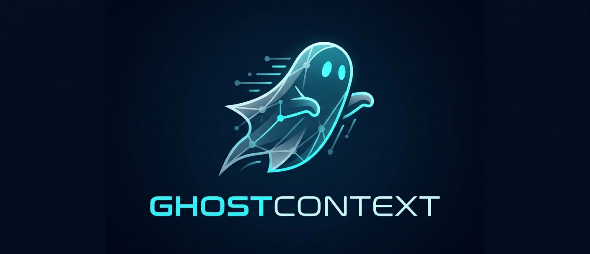

<p align="center">
  
</p>

<h1 align="center">GhostContext</h1>

<p align="center">
  <strong>Память для вашей локальной нейросети без раздувания контекстного окна.</strong><br />
  Один прокси — и Cursor, Continue, Open WebUI снова «помнят», о чём вы говорили вчера.
</p>

<p align="center">
  
  
  
  
</p>

---

## Зачем это нужно

Окно контекста дорогое: на слабом железе каждый лишний токен бьёт по VRAM и скорости. **GhostContext** не пытается засунуть всю историю чата в промпт. Он:

- **пишет** каждый обмен в понятные **Markdown-логи по дням** — вы всегда можете открыть файл и поправить «память» руками;
- **индексирует** диалоги в **ChromaDB** и перед ответом модели **достаёт несколько релевантных фрагментов** из прошлых сессий;
- **проксирует** запросы в ваш настоящий **OpenAI-совместимый** бэкенд — LM Studio, Ollama, облако, что угодно с полем **Base URL**.

Итог: модель получает **актуальный короткий диалог** плюс **точечную память** по смыслу, а не километровый дамп чата.

## Кому зайдёт

| Вы… | GhostContext… |
|-----|-----------------|
| Живёте в **Cursor / Continue / Open WebUI** | Подключается как обычный OpenAI endpoint — сменили Base URL и работаете |
| Гоняете **локальные модели** | Память на диске; эмбеддинги можно держать лёгкими (roadmap: выбор модели) |
| Не доверяете «чёрным ящикам» | Логи — обычные файлы в `context_logs/`, база — в каталоге Chroma рядом с проектом |

Это **не** корпоративный коннектор к Notion и Slack — узкий фокус на личных диалогах и локальных логах.

## Как это устроено

1. Клиент шлёт запрос на **ваш** `http://localhost:8000/v1` → GhostContext ищет похожие куски в Chroma и аккуратно дописывает их в системный контекст.  
2. Ответ модели уходит клиенту, а пара «вопрос — ответ» **сохраняется в лог и в векторную базу** для следующих запросов.

## Быстрый старт

**Нужно:** Python **3.11+** и работающий upstream с OpenAI-совместимым API (например LM Studio на `http://127.0.0.1:1234/v1`).

### Windows (PowerShell)

```powershell
cd ghostcontext
python -m venv .venv
.\.venv\Scripts\Activate.ps1
pip install -e .
```

### Linux / macOS

```bash
cd ghostcontext
python3 -m venv .venv
source .venv/bin/activate
pip install -e .
```

Только зависимости без установки пакета:

```bash
pip install -r requirements.txt
```

Скопируйте [`.env.example`](.env.example) в `.env`, при необходимости поправьте `GHOSTCONTEXT_UPSTREAM_BASE_URL` и пути.

**Запуск:**

```bash
python -m ghostcontext
```

Прокси: `http://<host>:<port>` — эндпоинты **`/v1/chat/completions`** и **`/v1/models`**.

## Подключение IDE и чатов

Укажите **Base URL** на GhostContext и любой **API Key** (для самого прокси он не проверяется; в upstream уходит ключ из `.env`).

### Cursor

1. Settings → **Models** → OpenAI / кастомный OpenAI.  
2. **Override Base URL:** `http://127.0.0.1:8000/v1`  
3. API Key: например `sk-local`

### Continue

В `config.json` у модели: `"apiBase": "http://127.0.0.1:8000/v1"`

### Open WebUI

Новый источник OpenAI-совместимый API с URL `http://127.0.0.1:8000/v1`.

## Конфигурация (кратко)

| Переменная | Смысл |
|------------|--------|
| `GHOSTCONTEXT_UPSTREAM_BASE_URL` | URL реальной модели, обычно …`/v1` |
| `GHOSTCONTEXT_UPSTREAM_API_KEY` | Ключ для upstream |
| `GHOSTCONTEXT_LOG_DIR` | Логи (по умолчанию `context_logs`) |
| `GHOSTCONTEXT_CHROMA_PATH` | Данные Chroma (по умолчанию `chroma_data`) |
| `GHOSTCONTEXT_N_RESULTS` | Сколько фрагментов памяти подмешивать (по умолчанию `3`) |

Полный список — в [`.env.example`](.env.example).

## Альтернативный запуск

```bash
ghostcontext
```

или

```bash
uvicorn ghostcontext.app:app --host 0.0.0.0 --port 8000
```

## Ограничения MVP

- **Streaming** (`stream: true`) пока не поддерживается — ответ **501**; отключите поток в клиенте, если возможно.  
- Нет **middle-truncate** по токенам на стороне прокси.  
- Запись в лог и Chroma — **после** ответа модели, в фоне (`asyncio.to_thread`).

## Проверка

```bash
curl -s http://127.0.0.1:8000/v1/models
```

```bash
curl -s http://127.0.0.1:8000/v1/chat/completions ^
  -H "Content-Type: application/json" ^
  -d "{\"model\": \"your-upstream-model-id\", \"messages\": [{\"role\": \"user\", \"content\": \"Hello\"}], \"stream\": false}"
```

## Roadmap

- **SSE streaming** для `stream: true`  
- **Middle-truncate** по токенам + скользящее окно  
- Выбор **лёгкой embedding-модели** (например `all-MiniLM-L6-v2`)  
- **File-watcher** для переиндексации после ручных правок логов  
- Пример **systemd** в `deploy/`

## Лицензия

Материалы репозитория — [Creative Commons Attribution 4.0 International](https://creativecommons.org/licenses/by/4.0/) (**CC BY 4.0**). Полный текст — [LICENSE](LICENSE).
